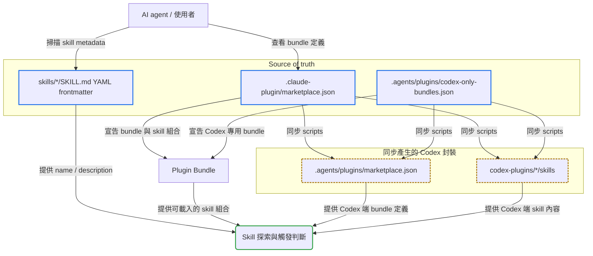

# misty-marketplace

Current version: [v2.0.0](release-note/v2.0.0.md)

將 Aery Lin 多年開發經驗與工程慣例收斂成可重複使用的 AI Agent Skills，並透過 Plugin Bundle 機制按情境組裝載入。

## Quick Navigation

- [專案結構](#專案結構)
- [Plugin Bundle](#plugin-bundle)
- [安裝 marketplace 與 plugin](#安裝-marketplace-與-plugin)
- [Skills 探索方式](#skills-探索方式)
- [維護原則](#維護原則)

---

## 專案結構

本 repo 以 [`.claude-plugin/marketplace.json`](.claude-plugin/marketplace.json) 定義 Plugin Bundle，它是所有 host 都能安裝的 bundle 與 skill 分組的 source of truth；只有 Codex 能用的 bundle 則宣告在 [`.agents/plugins/codex-only-bundles.json`](.agents/plugins/codex-only-bundles.json)，同一個 bundle 不會同時出現在兩份檔案。Skills 本體放在 [`skills/`](skills/) 目錄下。給 Codex 使用的 [`.agents/plugins/marketplace.json`](.agents/plugins/marketplace.json) 與 [`codex-plugins/`](codex-plugins/) 則由 [`scripts/sync-codex-plugins.ps1`](scripts/sync-codex-plugins.ps1) 或 [`scripts/sync-codex-plugins.sh`](scripts/sync-codex-plugins.sh) 同步產生，其中 [`codex-plugins/*/skills`](codex-plugins/) 只保留英文主檔、不包含任何 [`*_zhTW.md`](skills/)；同步流程也會回寫 [`codex-plugins/*/.codex-plugin/plugin.json`](codex-plugins/) 的 `version`，並以 [`scripts/verify_codex_plugins.py`](scripts/verify_codex_plugins.py) 驗證 package 內容與 source [`skills/`](skills/) 完全一致。README 只描述探索方式，不手動列舉每個 skill，避免文件與 [`SKILL.md`](skills/) frontmatter 不同步。[`SKILL.md`](skills/) 是英文主入口；若 skill 另外提供繁體中文版本，會放在同目錄的 [`*_zhTW.md`](skills/)。



[`skills/`](skills/) 底下每個 [`SKILL.md`](skills/) frontmatter 是 skill 名稱、用途與觸發條件的來源；需要了解有哪些 skills 時，應讀取這些 frontmatter，而不是依賴 README 的手動清單。若需要閱讀繁體中文說明，再讀對應的 [`*_zhTW.md`](skills/)。

[Back to top](#quick-navigation)

---

## Plugin Bundle

Plugin Bundle 是情境化的 skill 組合。一個 bundle 只在一份目錄中宣告，放在哪份由「哪些 host 能安裝它」決定：所有 host 都能用的以 [`.claude-plugin/marketplace.json`](.claude-plugin/marketplace.json) 為準，只有 Codex 能用的以 [`.agents/plugins/codex-only-bundles.json`](.agents/plugins/codex-only-bundles.json) 為準；[`.agents/plugins/marketplace.json`](.agents/plugins/marketplace.json) 與 [`codex-plugins/`](codex-plugins/) 僅是由同步腳本從這兩份宣告產生的 Codex 封裝層。README 只保留機制說明，不複製 bundle 內的 skills 清單。

| 資訊 | 來源 |
|------|------|
| Bundle 名稱與描述 | [`.claude-plugin/marketplace.json`](.claude-plugin/marketplace.json)、[`.agents/plugins/codex-only-bundles.json`](.agents/plugins/codex-only-bundles.json) |
| Bundle 包含哪些 skills | [`.claude-plugin/marketplace.json`](.claude-plugin/marketplace.json)、[`.agents/plugins/codex-only-bundles.json`](.agents/plugins/codex-only-bundles.json) |
| Bundle 能被哪些 host 安裝 | 它被宣告在哪一份目錄 |
| Skill 名稱、描述與觸發語意 | [`skills/*/SKILL.md`](skills/) 的 YAML frontmatter |
| Skill 詳細規則與 references | 各 skill 目錄中的 [`SKILL.md`](skills/) 與 [`references/`](skills/) |

[Back to top](#quick-navigation)

---

## 安裝 marketplace 與 plugin

本 repo 目前提供兩套 marketplace / plugin 入口：**Claude Code** 與 **GitHub Copilot CLI** 使用 [`.claude-plugin/marketplace.json`](.claude-plugin/marketplace.json)；**Codex** 使用 [`.agents/plugins/marketplace.json`](.agents/plugins/marketplace.json) 搭配 [`codex-plugins/`](codex-plugins/) 底下各自的 [`.codex-plugin/plugin.json`](codex-plugins/)。以下 GitHub Copilot 以 **GitHub Copilot CLI** 為準；若你主要在 VS Code 使用 GitHub Copilot，也可參考官方的 [agent plugins](https://code.visualstudio.com/docs/copilot/customization/agent-plugins) 說明。

| 維度 | Claude Code | GitHub Copilot CLI | Codex |
|------|------|------|------|
| 說明 | 依官方 [Discover and install plugins](https://code.claude.com/docs/en/discover-plugins) 與 [Create and distribute a plugin marketplace](https://code.claude.com/docs/en/plugin-marketplaces) 說明，Claude Code 可加入 GitHub repo、Git URL、local path 或 remote `marketplace.json`；此 repo 使用 [`.claude-plugin/marketplace.json`](.claude-plugin/marketplace.json)，marketplace 名稱是 `misty-plugins`。 | 依官方 [Finding and installing plugins](https://docs.github.com/en/copilot/how-tos/copilot-cli/customize-copilot/plugins-finding-installing) 與 [CLI plugin reference](https://docs.github.com/en/copilot/reference/copilot-cli-reference/cli-plugin-reference) 說明，Copilot CLI 可註冊 marketplace 並用 `plugin@marketplace` 安裝；此 repo 使用 [`.claude-plugin/marketplace.json`](.claude-plugin/marketplace.json)，marketplace 名稱是 `misty-plugins`。 | 依官方 [Plugins](https://developers.openai.com/codex/plugins) 與 [Build plugins](https://developers.openai.com/codex/plugins/build) 說明，Codex 可讀 [`.agents/plugins/marketplace.json`](.agents/plugins/marketplace.json)；此 repo 提供 `Misty Plugins`，並把 plugin package 放在 [`codex-plugins/`](codex-plugins/)。 |
| 安裝 | `/plugin marketplace add Aery9527/misty-marketplace`<br>`/plugin marketplace add .`<br>`/plugin install misty-work@misty-plugins`<br>`/plugin install misty-dev@misty-plugins`<br>`/reload-plugins` | `copilot plugin marketplace add Aery9527/misty-marketplace`<br>`copilot plugin marketplace add .`<br>`copilot plugin install misty-work@misty-plugins`<br>`copilot plugin install misty-dev@misty-plugins`<br>`copilot plugin list` | `codex plugin marketplace add Aery9527/misty-marketplace`<br>`codex plugin marketplace add .`<br>`codex`<br>`/plugins` |
| 更新 | `/plugin marketplace update misty-plugins`<br>`/reload-plugins`<br>或在 `/plugin` 的 Marketplaces tab 對 `misty-plugins` 啟用 auto-update。 | `copilot plugin update misty-work`<br>`copilot plugin update misty-dev`<br>`copilot plugin update --all`<br>官方 CLI reference 未列出 marketplace update 指令；若 marketplace source 本身變更，先移除再重新加入。 | `codex plugin marketplace upgrade misty-plugins`<br>或更新全部：`codex plugin marketplace upgrade`<br>再進入 `codex` 的 `/plugins` 確認已安裝 plugin 狀態。 |
| 移除 | `/plugin uninstall misty-work@misty-plugins`<br>`/plugin uninstall misty-dev@misty-plugins`<br>`/plugin marketplace remove misty-plugins`<br>官方文件說移除 marketplace 會同時移除從它安裝的 plugins。 | `copilot plugin uninstall misty-work`<br>`copilot plugin uninstall misty-dev`<br>`copilot plugin marketplace remove misty-plugins`<br>若 marketplace 仍有已安裝 plugin，官方文件說可用 `--force` 一併移除。 | `codex plugin marketplace remove misty-plugins`<br>若只要停用單一 plugin，進入 `codex` 後用 `/plugins` 管理。 |

[Back to top](#quick-navigation)

---

## Skills 探索方式

AI agent 需要掌握可用 skills 時，應掃描 [`skills/`](skills/) 底下所有 [`SKILL.md`](skills/) 的 YAML frontmatter，讀取 `name` 與 `description`。`description` 應提供足夠短而明確的用途、觸發時機與任務邊界，讓 agent 能判斷何時載入該 skill。若存在 [`*_zhTW.md`](skills/)，那是對應的繁體中文輔助版本，不是 discovery 入口。

建議流程：

1. 列出 [`skills/`](skills/) 底下所有第一層 skill 目錄。
2. 讀取每個 [`SKILL.md`](skills/) 開頭的 YAML frontmatter。
3. 用 `name` 作為 skill 識別名稱。
4. 用 `description` 判斷適用任務、觸發條件與是否需要進一步讀完整 [`SKILL.md`](skills/)。

[Back to top](#quick-navigation)

---

## 維護原則

新增、刪除或修改 [`skills/`](skills/) 內容時，必須同步檢查 [README.md](README.md) 是否仍能正確描述專案層級用途與探索方式，也要確認宣告其所屬 bundle 的那份目錄——[`.claude-plugin/marketplace.json`](.claude-plugin/marketplace.json) 或 [`.agents/plugins/codex-only-bundles.json`](.agents/plugins/codex-only-bundles.json)——是否仍正確反映 bundle 與 skill 分組。README 不應複製每個 skill 的完整描述；只需保留簡短說明，詳細資訊以各 [`SKILL.md`](skills/) frontmatter 與內容為準。新建 skill 時，[`SKILL.md`](skills/) 與 [`references/`](skills/) 內的原始 Markdown 檔必須以英文作為主檔，繁體中文版本使用同 basename 加上 [`*_zhTW.md`](skills/)；後續修改時，英文與 [`*_zhTW.md`](skills/) 兩邊都必須同步更新。

每次調整 skill 內容或 bundle 分組後，都必須重新執行同步腳本，讓 [`.agents/plugins/marketplace.json`](.agents/plugins/marketplace.json) 與 [`codex-plugins/*/skills`](codex-plugins/) 對齊 [`.claude-plugin/marketplace.json`](.claude-plugin/marketplace.json) 與 [`.agents/plugins/codex-only-bundles.json`](.agents/plugins/codex-only-bundles.json) 兩份宣告：

```powershell
.\scripts\sync-codex-plugins.ps1
```

```sh
./scripts/sync-codex-plugins.sh
```

[`codex-plugins/*/skills`](codex-plugins/) 是封裝副本，不是 source of truth；不要直接編輯它們。同步腳本會先複製整個 skill tree，再移除整棵目錄中的 [`*_zhTW.md`](skills/)，並用 [`.claude-plugin/marketplace.json`](.claude-plugin/marketplace.json) 的 `metadata.version` 回寫 [`codex-plugins/*/.codex-plugin/plugin.json`](codex-plugins/) 的 `version`——版本是整個 repo 共用的，Codex 專用 package 也由這裡取得。同步完成後，驗證腳本會檢查 [`codex-plugins/*/skills`](codex-plugins/) 與 source [`skills/`](skills/) 是否完全一致，唯一允許的差異是移除 [`*_zhTW.md`](skills/)。若新增新的 Codex plugin package，先補齊 [`codex-plugins/<plugin>/.codex-plugin/plugin.json`](codex-plugins/)，再執行同步腳本。

有些 Codex plugin 需要 skills 以外的 plugin-root 內容，例如 `commands/`、`agents/`、`scripts/` 與 `hooks.json`。這類檔案的 source of truth 一樣放在 [`skills/`](skills/) 底下：在該 skill 目錄內建立 `codex-plugin/` overlay 目錄，同步腳本會把它的內容提升到 [`codex-plugins/<plugin>/`](codex-plugins/) 的 plugin root，同時把 overlay 本身排除在 skill 副本之外。overlay 只擁有它自己宣告的那幾個 plugin-root 項目，因此 `.codex-plugin/` 與 `skills/` 不會被覆蓋；overlay 內也嚴禁出現這兩個名稱。驗證腳本會一併比對 overlay 與 plugin root 的內容。
當 overlay 提供 `hooks.json` 時，同步腳本也會在該 package 的 [`plugin.json`](codex-plugins/) 自動產生 `"hooks": "./hooks.json"`；移除 overlay hook 時，該宣告也會一併移除，避免 generated manifest 成為第二份設定來源。

[Back to top](#quick-navigation)
