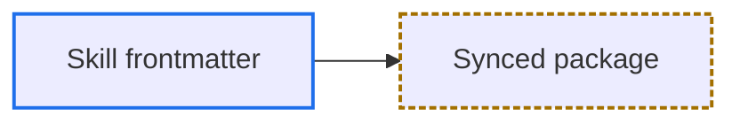
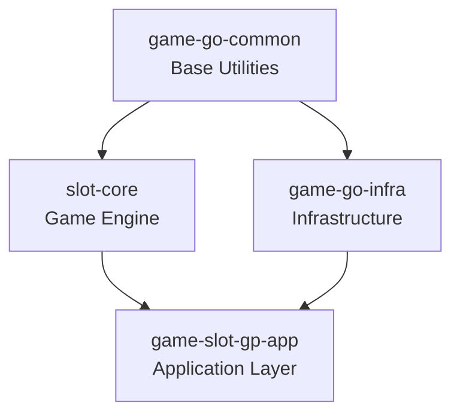
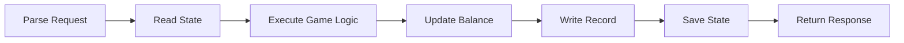
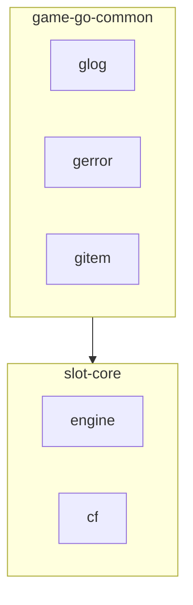
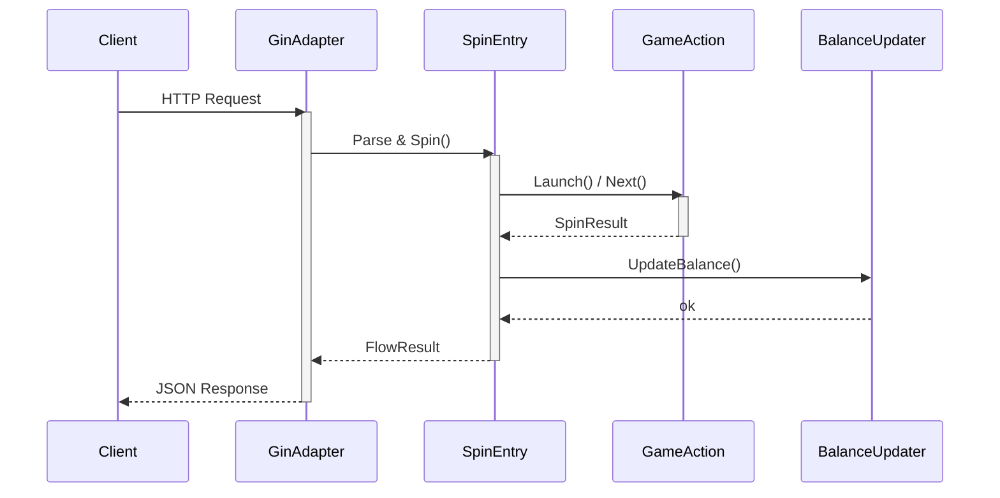
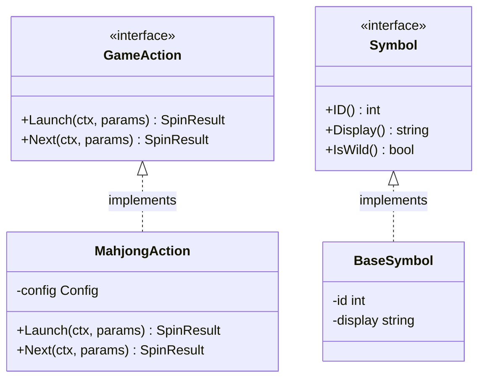
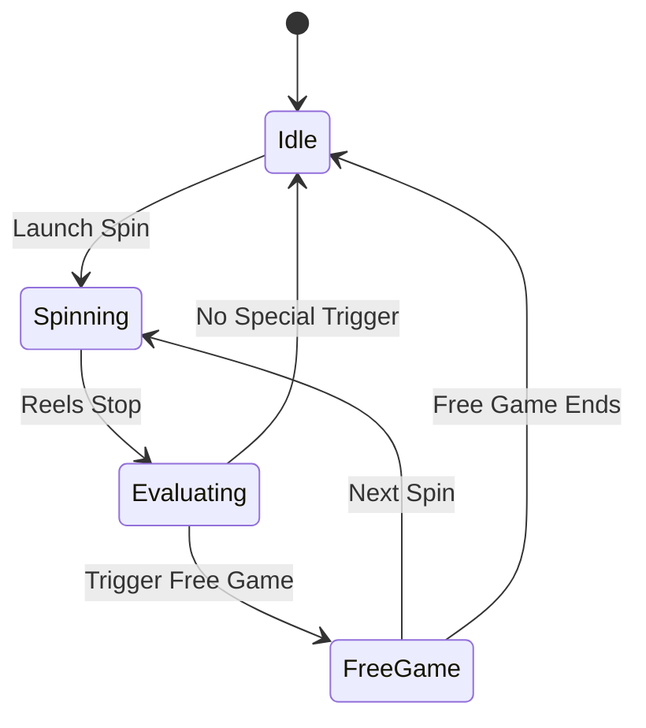
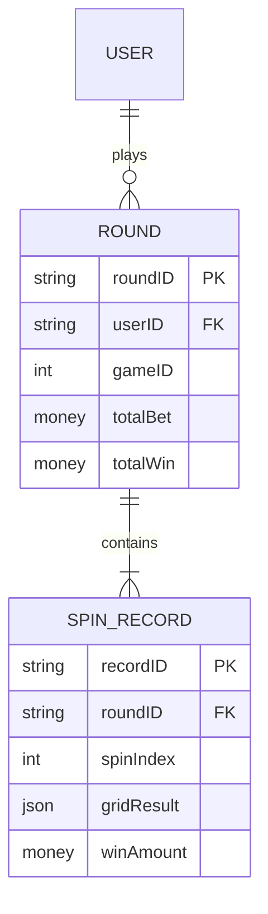

# Mermaid Guide

- Shared rules and examples for human-reader documents and AI-agent documents where the user explicitly requests Mermaid.

## Human-Reader Document Requirements

- Human-reader documents MUST use Mermaid to visualize core relationships, flows, states, or data flows.
- Even for simple content, include at least one brief Mermaid diagram to organize the main structure, flow, or decision relationship.
- If the document contains multiple diagrams, Quick Navigation should allow readers to jump directly to each diagram's section.
- Sections containing diagrams MUST still include a back-to-top link; MUST NOT omit it just because a Mermaid diagram is present.

## Diagram Design

- Mermaid diagrams MUST complement prose; they MUST NOT merely restate paragraph content.
- MUST NOT draw decorative diagrams unrelated to the document.
- Each diagram SHOULD focus on one concept; split complex systems into multiple diagrams.
- Node labels use English; identifiers stay ASCII.
- Add meaningful labels to flowchart edges to clarify relationship types.
- Keep diagram depth to 3-4 levels for readability.
- Use `subgraph` to group when there are 6+ nodes.
- Use `activate` / `deactivate` and `note` in sequence diagrams to mark key behaviors.
- Use `-->` solid lines for direct dependencies; `-.->` dashed lines for optional/indirect relationships.

## Diagram Selection

- **`flowchart TD`** — Module dependencies, call hierarchy: When the dependency chain between packages/modules is non-obvious.
- **`sequenceDiagram`** — Cross-service request/response flow: Temporal interactions among 3+ components.
- **`classDiagram`** — Interface/struct type relationships: Type hierarchy, interface implementations, struct composition.
- **`stateDiagram-v2`** — Lifecycle, state transitions: Entity flows between states with branching.
- **`erDiagram`** — Database schema, entity relationships: Data models with multiple foreign-key relationships.
- **`flowchart LR`** — Processing pipeline: Linear processing flows where direction and labels both matter.
- **`flowchart TD`** — Decision logic, branching flow: Conditional branches that are hard to express in prose.

- If a feature spans multiple aspects, combine diagram types only when each type provides independent insight; SHOULD NOT stack diagrams just for completeness.

## Mermaid Syntax Safety

- In Mermaid labels, escape syntax-significant characters with Mermaid's bare numeric form (no leading `&`): `#34;` for `"`, `#40;` for `(`, `#41;` for `)`, `#123;` for `{`, `#125;` for `}`. The `&#NN;` form MUST NOT be used; the `&` survives as a literal character.
- Diamond nodes `{}` MUST NOT contain bare parentheses: `()` is parsed as a rounded-rectangle token. Wrap the entire label in double quotes, e.g. `T1{"Is FormatStack implemented?"}`, or escape as above.
- For flowchart nodes, identifiers MUST use PascalCase ASCII and display text MUST appear in a quoted label, e.g. `ParseRequest["Parse request"]`. This avoids the lowercase reserved words and the `o` / `x` edge-marker ambiguity. Other diagram types follow their own identifier and alias syntax, where the identifier is often the display text itself.
- In `classDef` property lists, use comma-separated `property:value` pairs without CSS braces; MUST NOT use semicolons as property separators.
- The first non-blank, non-comment line MUST contain only the diagram declaration and its direction, e.g. `flowchart TD`; diagram content starts on the next line.
- A missing local Mermaid CLI does not establish that no compatible renderer is available. Before falling back to manual review, MUST try the project's renderer, the target preview, or a compatible rendering service when environment policy permits access.
- Before finalizing a diagram, verify rendering according to renderer availability:
    - If the target renderer or the same Mermaid version is available, MUST render with it and confirm that the expected nodes, edges, messages, or slices appear without a parser error.
    - If only a different compatible renderer is available, MUST use it to catch parser errors and state that target rendering remains unverified.
    - If no compatible renderer is available, MUST review every rule in this section and state that rendering was not verified.
    - Markdown lint, fence checks, link checks, and manual inspection are not render validation. MUST NOT present those checks as proof that the diagram renders.

## Mermaid Color and Readability

- `style` and `classDef` literals do not respond to theme changes. A hardcoded light `fill` stays light when the canvas flips to dark, leaving styled nodes as bright islands while unstyled nodes, edge labels, and subgraph titles follow the theme.

- MUST NOT hardcode `fill` or text `color` in `style`, `classDef`, or init directives; leave both to the renderer theme.
- Role distinctions MUST stay understandable without color, including in grayscale and for color-blind readers; encode them with label text, node shape, or line style.
- To distinguish roles visually, set only `stroke`, `stroke-width`, and `stroke-dasharray`.
- `stroke` MUST come from the approved palette: `#1f6feb` blue, `#2ea043` green, `#a37000` amber, `#cf222e` red, `#8250df` purple, `#797979` gray.
- Adding a palette color requires a measured contrast ratio of at least 3:1 against both `#ffffff` and `#0d1117` (WCAG 1.4.11). The approved values sit within OKLCH `L 0.55-0.63`, but L predicts contrast rather than proving it, so MUST NOT derive a new color from lightness alone.
- Style roles with `classDef` plus `class`; MUST NOT repeat per-node `style` lines.

- Example:

---

## Flowchart (Module Dependencies / Pipeline)

- Top-down for hierarchies:

- Left-to-right for pipelines:

- With subgraph grouping:

---

## Sequence Diagram (Component Interaction)

---

## Class Diagram (Interface / Struct Relationships)

---

## State Diagram (Game State / Lifecycle)

---

## ER Diagram (Data Model)

---

## Type-Specific Syntax Rules

- In sequence diagrams, place `:` between each message receiver and its message text, and close every `alt`, `opt`, and `loop` block with a matching `end`.
- In sequence diagrams, message and `Note` text MUST NOT contain a bare semicolon (`;`): Mermaid treats it as a statement terminator and parses the remaining text as a new instruction. Use a period or ` ` instead.
- In class diagrams, enclose relationship cardinalities in double quotes and include `()` in every method signature, including zero-argument methods.
- In ER diagrams, write each attribute as `<type> <name>`, e.g. `string userId PK`; MUST NOT reverse the order.
- Pie-chart values MUST be greater than zero; non-positive values may be rejected or produce no visible slice, depending on the renderer.

---

## Combining Diagrams

- When documenting a complex feature, combine diagram types according to their purposes:

    - **flowchart** for the high-level architecture or module dependency.
    - **sequenceDiagram** for the runtime interaction between components.
    - **stateDiagram-v2** for any state machine or lifecycle.
    - **classDiagram** for interface/struct type relationships if needed.

- Choose the minimum set of diagrams that fully conveys the feature. Avoid redundancy between diagrams.
