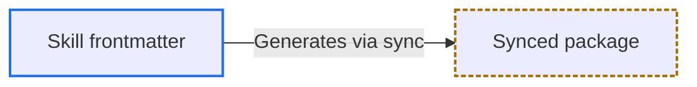
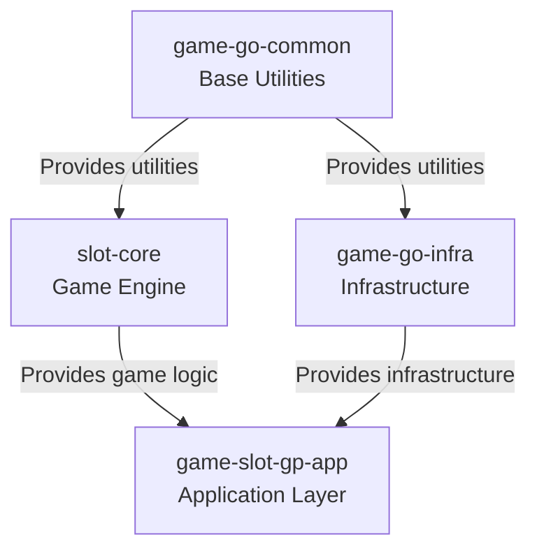
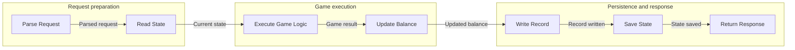
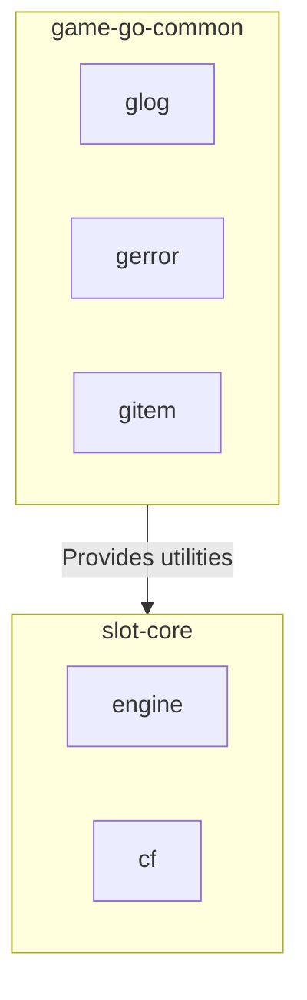
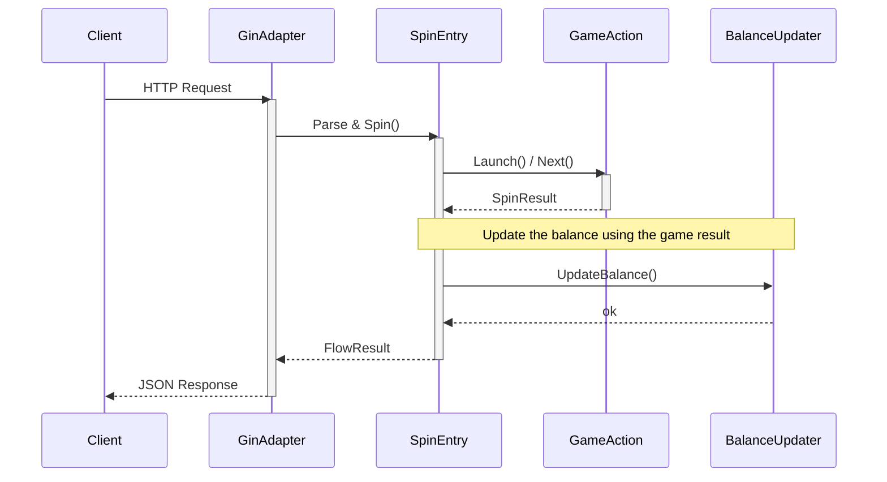
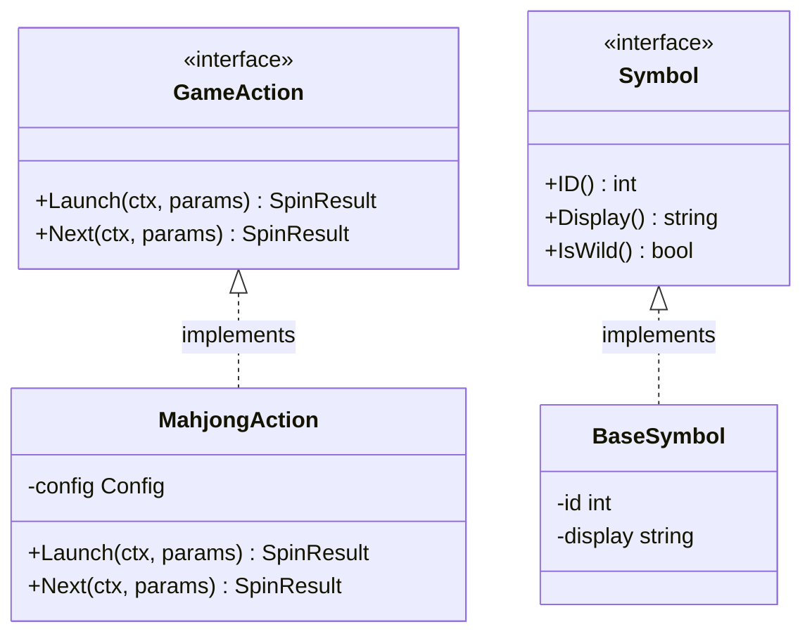
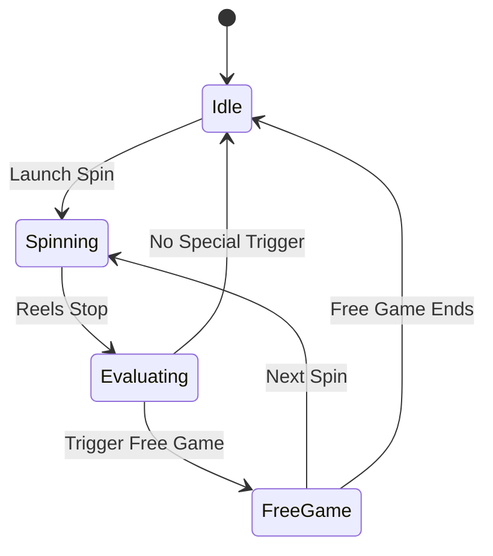
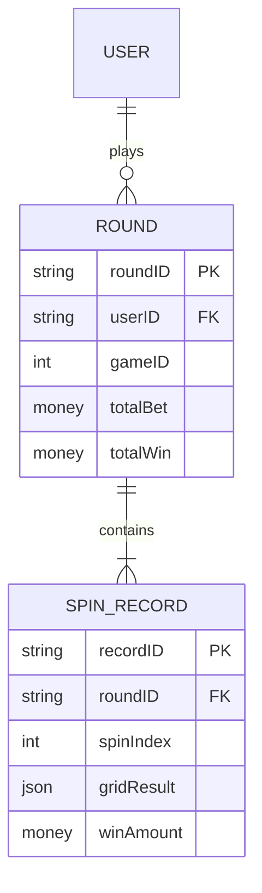

# Mermaid Guide

- Shared rules and examples for human-reader documents and AI-agent documents where the user explicitly requests Mermaid.
- Document requirements, layout, naming, and palette choices below are this skill's conventions, not Mermaid syntax restrictions. MUST use the [Mermaid documentation](https://mermaid.js.org/intro/syntax-reference.html) for diagram-specific syntax supported by the target renderer.

## Human-Reader Document Requirements

- Human-reader documents MUST use Mermaid to visualize core relationships, flows, states, or data flows.
- Even for simple content, include at least one brief Mermaid diagram to organize the main structure, flow, or decision relationship.
- Human-reader diagrams SHOULD include `accTitle: ...` and `accDescr: ...` when supported by the target renderer, so assistive technologies can read their purpose and meaning.

## Diagram Design

- Mermaid diagrams MUST complement prose; they MUST NOT merely restate paragraph content.
- Each diagram SHOULD focus on one concept; split complex systems into multiple diagrams.
- Node labels use English; identifiers stay ASCII.
- Add meaningful labels to flowchart edges to clarify relationship types.
- Keep diagram depth to 3-4 levels for readability.
- In flowcharts, use `subgraph` to group when there are 6+ nodes.
- Use `activate` / `deactivate` and `note` in sequence diagrams to mark key behaviors.
- In flowcharts, use `-->` solid lines for direct dependencies and `-.->` dashed lines for optional/indirect relationships. Other diagram types have their own arrow syntax and semantics.

## Diagram Selection

- **`flowchart TD`** — Module dependencies, call hierarchy: When the dependency chain between packages/modules is non-obvious.
- **`sequenceDiagram`** — Cross-service request/response flow: Temporal interactions among 3+ components.
- **`classDiagram`** — Interface/struct type relationships: Type hierarchy, interface implementations, struct composition.
- **`stateDiagram-v2`** — Lifecycle, state transitions: Entity flows between states with branching.
- **`erDiagram`** — Database schema, entity relationships: Data models with multiple foreign-key relationships.
- **`flowchart LR`** — Processing pipeline: Linear processing flows where direction and labels both matter.
- **`flowchart TD`** — Decision logic, branching flow: Conditional branches that are hard to express in prose.

- If a feature spans multiple aspects, combine diagram types only when each type provides independent insight; SHOULD NOT stack diagrams just for completeness.

## Mermaid Syntax Safety

- Flowchart labels containing syntax-significant characters MUST be quoted, e.g. `T1{"Is FormatStack() implemented?"}`. Unquoted parentheses in diamond labels are parsed as shape tokens.
- When escaping label text, MUST use Mermaid's bare numeric form (no leading `&`): `#34;` for a quote inside a quoted label, `#35;` for `#`, `#59;` for `;`, `#40;` / `#41;` for parentheses, and `#123;` / `#125;` for braces. MUST NOT use `&#NN;`; it leaves an extra `&`.
- For flowchart nodes, identifiers MUST use PascalCase ASCII and display text MUST appear in a quoted label, e.g. `ParseRequest["Parse request"]`. This avoids the lowercase reserved words and the `o` / `x` edge-marker ambiguity. Other diagram types follow their own identifier and alias syntax, where the identifier is often the display text itself.
- In `classDef` property lists, MUST use comma-separated `property:value` pairs without CSS braces; MUST NOT use semicolons as property separators.
- In flowchart `classDef` statements, separate `stroke-dasharray` lengths with spaces, e.g. `4 2`, or escape value commas as `\,`. Other diagram types MUST follow their own styling syntax and renderer behavior.
- For readability, MUST place the diagram declaration and its supported modifiers on their own line, e.g. `flowchart TD` or `pie showData`; content starts on the next line. Class and state diagrams use a separate `direction` statement.
- If using YAML frontmatter, MUST place it at the start of the Mermaid block, before the declaration. Prefer its `config` field over deprecated init directives when the target renderer supports it.
- A missing local Mermaid CLI does not establish that no compatible renderer is available. Before falling back to manual review, MUST try the project's renderer, the target preview, or a compatible rendering service when environment policy permits access.
- Before finalizing a diagram, verify rendering according to renderer availability:
    - If the target renderer or a matching Mermaid version and configuration is available, MUST render with it and verify the expected nodes, edges, messages, and slices, including their counts and complete label text, not just the absence of parser errors. MUST include relevant light and dark themes in readability checks.
    - If only a different compatible renderer is available, MUST use it for the same checks and state which version was tested and that target rendering remains unverified.
    - When styles are used, MUST confirm that the intended styles actually apply to the target elements; successful parsing alone does not establish this.
    - If no compatible renderer is available, MUST review every rule in this section and state that rendering was not verified.
    - Markdown lint, fence checks, link checks, and manual inspection are not render validation. MUST NOT present those checks as proof that the diagram renders.

## Mermaid Color and Readability

- Literal colors in `style` and `classDef` stay fixed. Theme colors are resolved when the SVG is rendered; changing the page theme alone does not regenerate the SVG.

- MUST NOT hardcode fill or text colors in `style`, `classDef`, or diagram configuration, including frontmatter `config.themeVariables` and init directives; leave them to the renderer theme.
- Role distinctions MUST stay understandable without color, including in grayscale and for color-blind readers; encode them with label text, node shape, or line style.
- To distinguish roles visually, set only `stroke`, `stroke-width`, and `stroke-dasharray`.
- `stroke` MUST come from the approved palette: `#1f6feb` blue, `#2ea043` green, `#a37000` amber, `#cf222e` red, `#8250df` purple, `#797979` gray.
- New palette colors MUST have measured contrast of at least 3:1 against both `#ffffff` and `#0d1117`. Meaningful graphical elements MUST also meet 3:1 against their actual adjacent colors in the intended themes; the reference backgrounds alone do not establish [WCAG 1.4.11](https://www.w3.org/WAI/WCAG22/Understanding/non-text-contrast.html) compliance.
- The approved values sit within OKLCH `L 0.55-0.63`, but L predicts contrast rather than proving it; MUST NOT derive a new color from lightness alone.
- MUST reuse role styles; MUST NOT repeat per-node `style` lines.
    - Flowcharts, state diagrams, and ER diagrams use `classDef` plus `class`.
    - For class diagrams, MUST declare classes and assign styles with `cssClass` or `:::` before defining those styles with `classDef`, e.g. `class Animal:::roleStyle` followed by `classDef roleStyle stroke:#1f6feb`.
    - Sequence diagrams do not support these statements; other types MUST follow their own styling syntax.

- Example:

---

## Flowchart (Module Dependencies / Pipeline)

- Top-down for hierarchies:

- Left-to-right for pipelines:

- With subgraph grouping:

---

## Sequence Diagram (Component Interaction)

---

## Class Diagram (Interface / Struct Relationships)

---

## State Diagram (Game State / Lifecycle)

---

## ER Diagram (Data Model)

---

## Type-Specific Syntax Rules

- In sequence diagrams, MUST place `:` between each message receiver and its message text, and close every `alt`, `opt`, and `loop` block with a matching `end`.
- In sequence diagrams, messages, `Note` text, block labels, and participant aliases MUST NOT contain bare `#` or `;`: `#` silently discards the rest of the line as a comment, and `;` ends the statement. Use `#35;` and `#59;` respectively, e.g. `C#35; client` displays `C# client`.
- Sequence participant IDs MUST NOT match keywords such as `End`, `Box`, `Loop`, or `Note`; keyword matching ignores case. Use a distinct ID and an `as` alias for the desired display text.
- In class diagrams, MUST enclose relationship cardinalities in double quotes and include `()` in every method signature, including zero-argument methods.
- In ER diagrams, MUST write each attribute as `<type> <name>`, e.g. `string userId PK`; MUST NOT reverse the order.
- Pie-chart values MUST be nonnegative, with at least one positive value and unique labels. Negative values are rejected; duplicate labels are ignored after the first entry.
- Pie slices below 1% of the total are omitted from the drawing while their legend entries remain. MUST verify slices and labels against the source data in the target renderer; use accompanying text or a different chart when omitted slices matter, rather than changing the data.

---

## Combining Diagrams

- When documenting a complex feature, combine diagram types according to their purposes:

    - **flowchart** for the high-level architecture or module dependency.
    - **sequenceDiagram** for the runtime interaction between components.
    - **stateDiagram-v2** for any state machine or lifecycle.
    - **classDiagram** for interface/struct type relationships if needed.

- Choose the minimum set of diagrams that fully conveys the feature. Avoid redundancy between diagrams.
