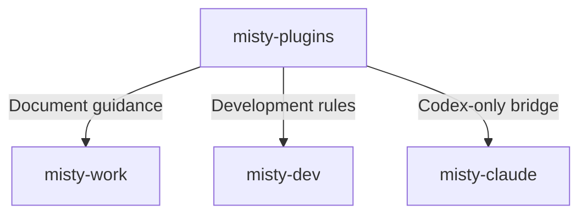

# v2.0.0

- 來源：[v1.0.0](v1.0.0.md)，包含後續 8 筆提交。

## 目錄

- [升級須知](#升級須知)
- [功能](#功能)
- [修正](#修正)
- [文件](#文件)
- [重構](#重構)
- [維護](#維護)

## 升級須知

- 本版移除 `go-mongo-rules` skill 與 `misty-dev-go` bundle，屬於破壞性變更，不再提供該組 MongoDB 開發規則。
- 若已安裝 `misty-dev-go`，請移除該 plugin；若專案明確要求載入 `go-mongo-rules`，請同步調整該要求。
- 其餘 bundle 名稱不變，可依 [README 的安裝與更新說明](../README.md#安裝-marketplace-與-plugin) 更新。
- 本版保留的 bundle 分工如下：

[回到目錄](#目錄)

---

## 功能

- 本版未新增 skill 或 bundle。

[回到目錄](#目錄)

---

## 修正

- 修正 Mermaid 的特殊字元、各圖型語法與樣式適用範圍，補齊圖表內容、樣式效果與主題可讀性的驗證要求。
- 修正 `windows-script` 的錯誤處理、exit code、編碼與 BOM、5.1 路徑參數相容性，以及工作目錄與編碼設定的還原指引。

[回到目錄](#目錄)

---

## 文件

- `write-md` 統一以清單呈現注意事項，精簡 AI 文件的結構限制，並將 Mermaid 規則集中為共用指南；使用者明確指定時，AI 文件也可使用 Mermaid。
- `code-rules` 以分派表與 Strategy Pattern 精簡分支重構原則，釐清註解職責及隱含契約，並精簡參數、註解與日誌規則。
- `windows-script` 合併重複的 checklist 與常見誤區，保留適用條件及必要範例。
- 上述指引同步維護中英文內容與 Codex 封裝。

[回到目錄](#目錄)

---

## 重構

- 本版無獨立的程式重構項目。

[回到目錄](#目錄)

---

## 維護

- 清除已移除 skill 與 bundle 的安裝目錄項目、封裝及相關引用。
- Marketplace 與保留的 Codex plugin 版本統一更新為 `2.0.0`，並僅保留最新 5 份 release note。

[回到目錄](#目錄)
