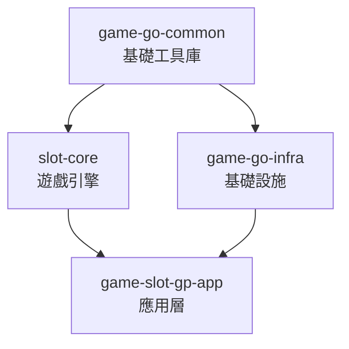
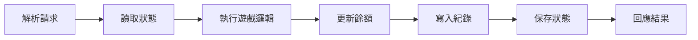
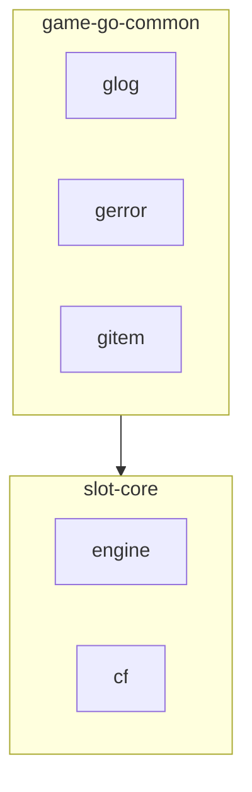
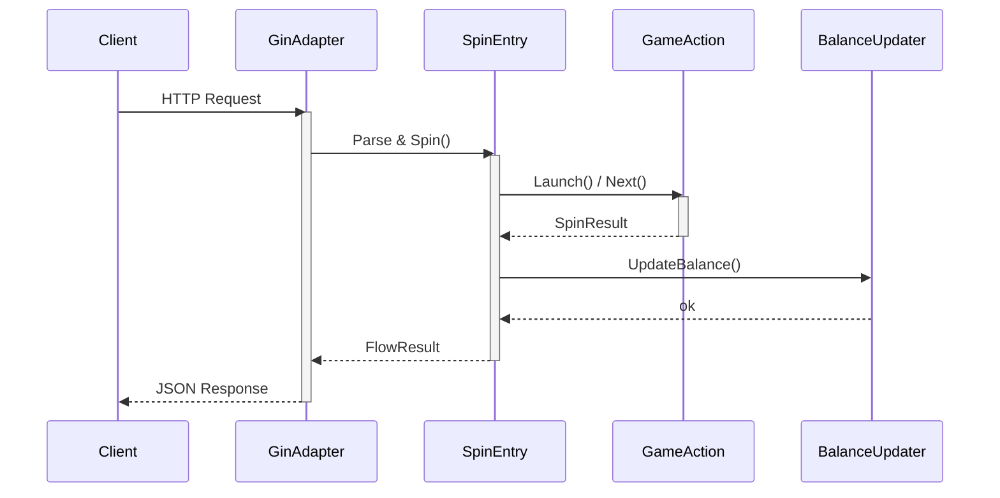
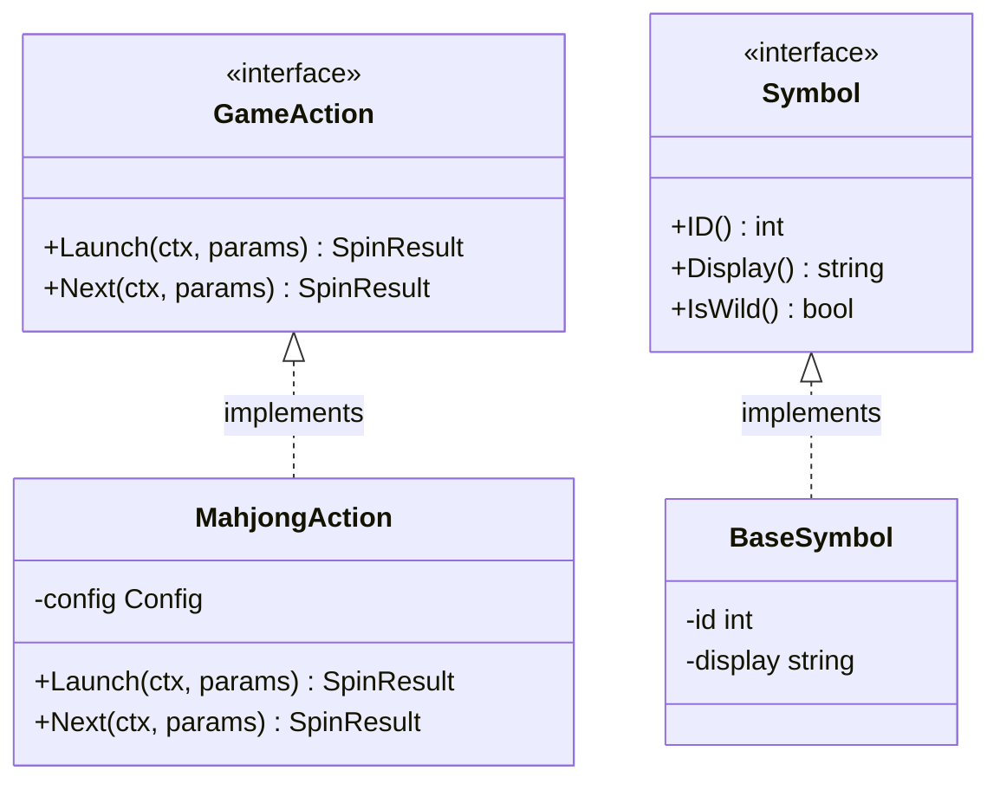
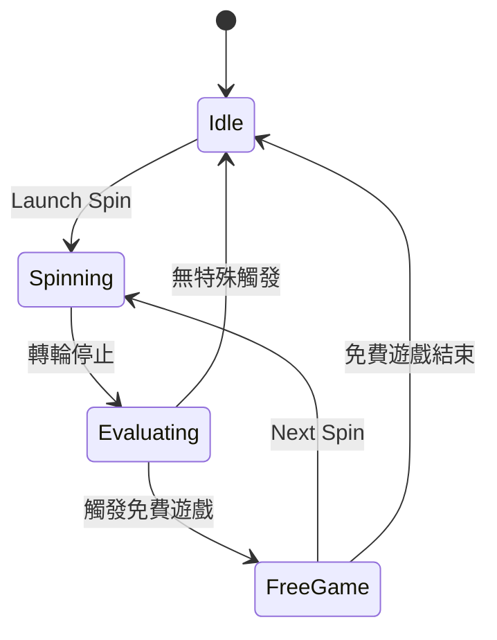
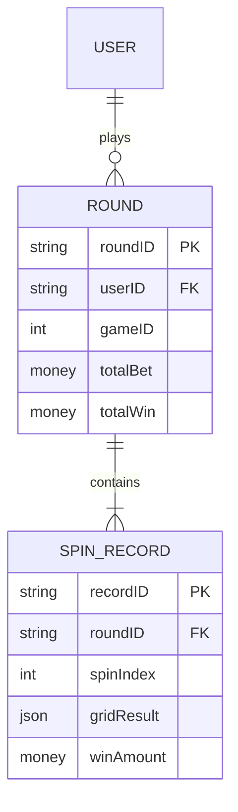

# Mermaid 指南

- 人類文件與使用者明確指定 Mermaid 的 AI 文件，共用此處的規則與範例。

## 人類文件專用要求

- 人類讀者文件必須使用 Mermaid 視覺化核心關係、流程、狀態或資料流。
- 若內容很單純，也至少用一張簡短 Mermaid 圖整理主要結構、流程或決策關係。
- 若文件含多張圖，快速導覽應讓讀者能快速跳到各圖所在章節。
- 圖所在章節在收尾時必須保留回頂 link，且嚴禁因為有 Mermaid 就省略。

## 圖表設計

- Mermaid 必須補充文字，且嚴禁只重複段落內容。
- 嚴禁為了湊圖而畫與文件無關的裝飾圖。
- 每張圖應專注於一個概念；複雜系統拆成多張圖。
- Node label 使用繁體中文，identifier 維持英文。
- flowchart 的連線要加有意義的 label 說明關係類型。
- 圖的深度控制在 3-4 層以維持可讀性。
- 節點 >=6 個時用 `subgraph` 分群。
- sequence diagram 用 `activate` / `deactivate` 與 `note` 標示關鍵行為。
- 直接相依用 `-->` 實線，可選 / 間接關係用 `-.->` 虛線。

## 圖表選擇

- **`flowchart TD`** — 模組相依、呼叫層級：套件 / 模組間相依鏈不直觀時。
- **`sequenceDiagram`** — 跨服務的請求 / 回應流程：>=3 個元件之間的時序互動。
- **`classDiagram`** — 介面 / struct 型別關係：型別層級、介面實作、struct 組合。
- **`stateDiagram-v2`** — 生命週期、狀態轉換：實體在有分支的狀態間流轉。
- **`erDiagram`** — 資料庫 schema、實體關係：有多個外鍵關係的資料模型。
- **`flowchart LR`** — 處理 pipeline：方向與標籤都很重要的線性處理流程。
- **`flowchart TD`** — 決策邏輯、分支流程：用文字難以說清楚的條件分支。

- 若一個功能橫跨多個面向，只在每種圖各自帶來獨立洞見時才組合使用；不應為求完整而堆圖。

## Mermaid 語法安全

- Mermaid label 內的語法敏感字元必須使用 Mermaid 的裸數字形式跳脫（開頭不加 `&`）：`#34;` 代表 `"`、`#40;` 代表 `(`、`#41;` 代表 `)`、`#123;` 代表 `{`、`#125;` 代表 `}`。嚴禁使用 `&#NN;` 形式，其 `&` 會殘留成字面字元。
- 菱形節點 `{}` 內嚴禁放裸括號：`()` 會被 parser 當作圓角矩形 token。改用雙引號包住整段文字，例如 `T1{"是否實作 FormatStack？"}`，或依上述形式跳脫。
- flowchart 的節點 identifier 必須使用 PascalCase ASCII，顯示文字必須放進 quoted label，例如 `ParseRequest["解析請求"]`。此慣例可避開小寫保留字與 `o` / `x` 開頭的 edge marker 歧義。其他圖型依各自的 identifier 與 alias 語法，其 identifier 往往本身就是顯示文字。
- `classDef` 的屬性清單必須使用逗號分隔的 `property:value`，嚴禁用 CSS 大括號包裹，也嚴禁用分號分隔屬性。
- 第一個非空白、非註解行必須只包含圖表宣告與其方向，例如 `flowchart TD`，圖表內容從下一行開始。
- 本機缺少 Mermaid CLI，不代表環境中沒有可用的相容 renderer。改採人工檢查前，只要環境政策允許存取，就必須先嘗試專案 renderer、目標 preview 或相容的 rendering service。
- 圖表定稿前，依 renderer 可用情況驗證渲染：
    - 若環境有目標 renderer 或相同 Mermaid 版本，必須實際渲染，並確認預期的節點、連線、訊息或切片確實出現在輸出中，而且沒有 parser error。
    - 若只有其他相容 renderer，仍必須用它攔截 parser error，並明確聲明尚未驗證目標 renderer。
    - 若沒有相容的 renderer，必須逐條檢查本節所有規則，並明確聲明未經渲染驗證。
    - Markdown lint、fence 檢查、link 檢查與人工檢視都不算渲染驗證；嚴禁把上述檢查表述為「已驗證可渲染」。

## Mermaid 配色與可讀性

- `style` 與 `classDef` 的字面色不會隨主題翻轉。硬編的淺色 `fill` 在畫布切換成深色時仍是淺色，上色節點因此成為亮色孤島，而未上色節點、連線 label 與 subgraph 標題則跟著主題走。

- 嚴禁在 `style`、`classDef` 或 init 設定中硬編 `fill` 與文字 `color`，兩者必須交由 renderer 主題決定。
- 角色差異必須在沒有顏色的情況下仍可理解，包含灰階列印與色覺障礙讀者；必須以 label 文字、節點形狀或線型編碼。
- 需要視覺區分時，只設定 `stroke`、`stroke-width` 與 `stroke-dasharray`。
- `stroke` 必須取自核准色票：`#1f6feb` 藍、`#2ea043` 綠、`#a37000` 琥珀、`#cf222e` 紅、`#8250df` 紫、`#797979` 灰。
- 新增色票必須實測對 `#ffffff` 與 `#0d1117` 皆達 3:1（WCAG 1.4.11）。核准色值落在 OKLCH `L 0.55-0.63` 區間內，但 L 只能預測對比、不能證明對比，嚴禁僅憑明度推導新色。
- 以 `classDef` 搭配 `class` 標示角色，嚴禁逐節點重複寫 `style`。

- 範例：

---

## Flowchart（模組相依／Pipeline）

- 階層關係採由上至下：

- Pipeline 採由左至右：

- 使用 subgraph 分群：

---

## Sequence Diagram（元件互動）

---

## Class Diagram（介面／Struct 關係）

---

## State Diagram（遊戲狀態／生命週期）

---

## ER Diagram（資料模型）

---

## 圖型專屬語法規則

- sequence diagram 的訊息必須在接收者與訊息文字之間放 `:`，且每個 `alt`、`opt`、`loop` 區塊必須有配對的 `end`。
- sequence diagram 的 message 與 `Note` 文字嚴禁包含裸分號（`;`）：Mermaid 會把它當成語句終止符，並將剩餘文字解析成新指令。改用句號或 ` `。
- class diagram 的 relationship cardinality 必須以雙引號包裹；方法簽章必須包含括號，無參數時使用 `()`。
- ER diagram 的屬性必須寫成 `<type> <name>`，例如 `string userId PK`，嚴禁顛倒順序。
- pie chart 的數值必須大於零；非正數可能被拒絕或不產生可見切片，實際行為依 renderer 而異。

---

## 組合圖表

- 描述複雜功能時，依各自用途組合圖表：

    - **flowchart**：高階架構或模組相依。
    - **sequenceDiagram**：元件的執行期互動。
    - **stateDiagram-v2**：狀態機或生命週期。
    - **classDiagram**：需要時呈現介面／Struct 型別關係。

- 選擇能完整表達功能的最少圖表，避免重複呈現相同資訊。
