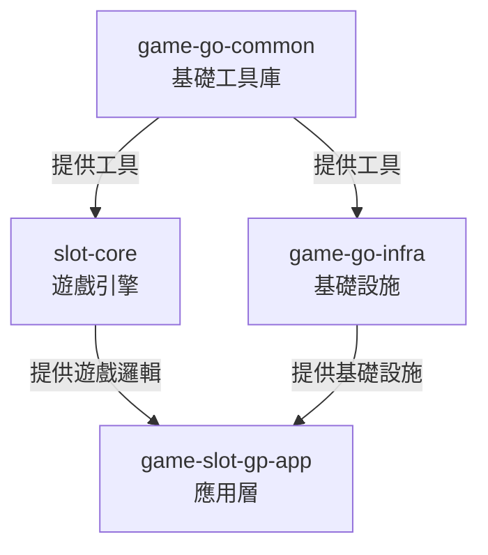
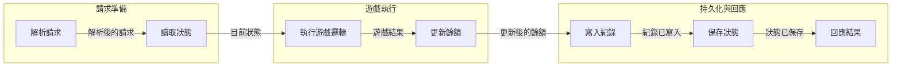
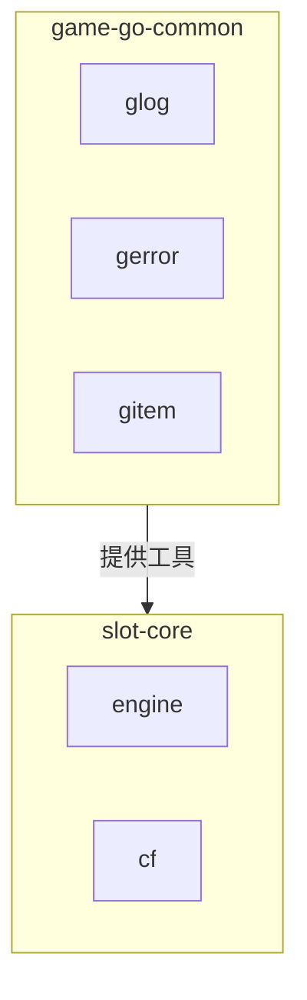
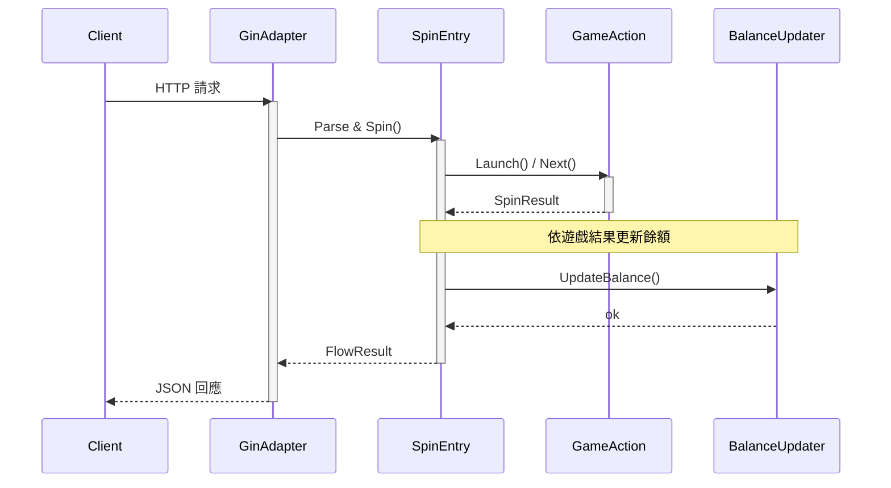
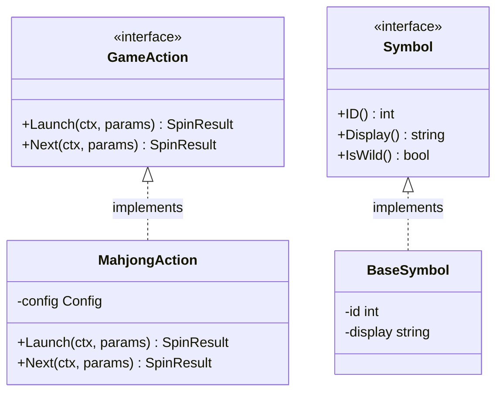
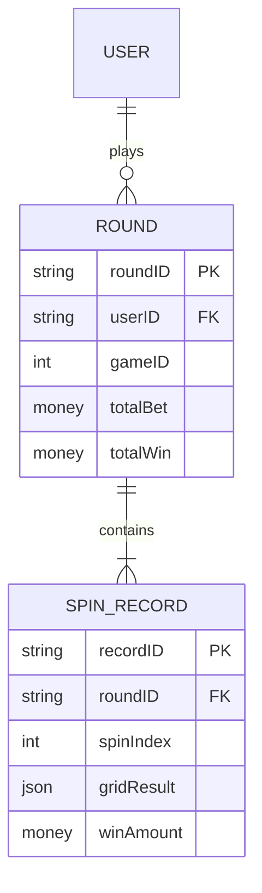

# Mermaid 指南

- 人類文件與使用者明確指定 Mermaid 的 AI 文件，共用此處的規則與範例。
- 以下文件要求、布局、命名與色票是本技能的慣例，不是 Mermaid 語法限制；各圖型語法必須以目標 renderer 支援的 [Mermaid 文件](https://mermaid.js.org/intro/syntax-reference.html) 為準。

## 人類文件專用要求

- 人類讀者文件必須使用 Mermaid 視覺化核心關係、流程、狀態或資料流。
- 若內容很單純，也至少用一張簡短 Mermaid 圖整理主要結構、流程或決策關係。
- 目標 renderer 支援時，人類文件的圖表應提供 `accTitle: ...` 與 `accDescr: ...`，讓輔助技術能讀取圖表用途與意義。

## 圖表設計

- Mermaid 必須補充文字，且嚴禁只重複段落內容。
- 每張圖應專注於一個概念；複雜系統拆成多張圖。
- Node label 使用繁體中文，identifier 維持英文。
- flowchart 的連線要加有意義的 label 說明關係類型。
- 圖的深度控制在 3-4 層以維持可讀性。
- flowchart 節點 >=6 個時用 `subgraph` 分群。
- sequence diagram 用 `activate` / `deactivate` 與 `note` 標示關鍵行為。
- flowchart 中，直接相依用 `-->` 實線，可選 / 間接關係用 `-.->` 虛線；其他圖型依各自的箭頭語法與語意。

## 圖表選擇

- **`flowchart TD`** — 模組相依、呼叫層級：套件 / 模組間相依鏈不直觀時。
- **`sequenceDiagram`** — 跨服務的請求 / 回應流程：>=3 個元件之間的時序互動。
- **`classDiagram`** — 介面 / struct 型別關係：型別層級、介面實作、struct 組合。
- **`stateDiagram-v2`** — 生命週期、狀態轉換：實體在有分支的狀態間流轉。
- **`erDiagram`** — 資料庫 schema、實體關係：有多個外鍵關係的資料模型。
- **`flowchart LR`** — 處理 pipeline：方向與標籤都很重要的線性處理流程。
- **`flowchart TD`** — 決策邏輯、分支流程：用文字難以說清楚的條件分支。

- 若一個功能橫跨多個面向，只在每種圖各自帶來獨立洞見時才組合使用；不應為求完整而堆圖。

## Mermaid 語法安全

- flowchart label 含語法敏感字元時，必須以引號包住，例如 `T1{"是否實作 FormatStack()？"}`；菱形 label 內未加引號的括號會被解析成圖形 token。
- label 文字需要跳脫時，必須使用 Mermaid 的裸數字形式（開頭不加 `&`）：`#34;` 表示引號內的雙引號、`#35;` 表示 `#`、`#59;` 表示 `;`、`#40;` / `#41;` 表示小括號、`#123;` / `#125;` 表示大括號。嚴禁使用 `&#NN;`，它會多留一個 `&`。
- flowchart 的節點 identifier 必須使用 PascalCase ASCII，顯示文字必須放進 quoted label，例如 `ParseRequest["解析請求"]`。此慣例可避開小寫保留字與 `o` / `x` 開頭的 edge marker 歧義。其他圖型依各自的 identifier 與 alias 語法，其 identifier 往往本身就是顯示文字。
- `classDef` 的屬性清單必須使用逗號分隔的 `property:value`，嚴禁用 CSS 大括號包裹，也嚴禁用分號分隔屬性。
- flowchart `classDef` 的 `stroke-dasharray` 長度以空白分隔，例如 `4 2`；也可將數值中的逗號跳脫成 `\,`。其他圖型必須依各自的樣式語法與 renderer 行為。
- 為方便閱讀，圖表宣告與該圖型支援的參數必須獨立一行，例如 `flowchart TD` 或 `pie showData`；內容從下一行開始。Class 與 state diagram 的方向使用獨立的 `direction` 陳述。
- 若使用 YAML frontmatter，必須放在 Mermaid 區塊開頭、圖表宣告之前；目標 renderer 支援時，優先使用其 `config` 欄位，取代已棄用的 init directive。
- 本機缺少 Mermaid CLI，不代表環境中沒有可用的相容 renderer。改採人工檢查前，只要環境政策允許存取，就必須先嘗試專案 renderer、目標 preview 或相容的 rendering service。
- 圖表定稿前，依 renderer 可用情況驗證渲染：
    - 若環境有目標 renderer，或相同 Mermaid 版本與設定，必須實際渲染並核對預期節點、連線、訊息與切片的數量及完整 label 文字，嚴禁只確認沒有 parser error；可讀性檢查也必須涵蓋適用的淺色與深色主題。
    - 若只有其他相容 renderer，仍必須用它完成相同檢查，並聲明測試版本及尚未驗證目標 renderer。
    - 有使用樣式時，必須確認預期樣式確實套用到目標元素，嚴禁只看解析成功。
    - 若沒有相容的 renderer，必須逐條檢查本節所有規則，並明確聲明未經渲染驗證。
    - Markdown lint、fence 檢查、link 檢查與人工檢視都不算渲染驗證；嚴禁把上述檢查表述為「已驗證可渲染」。

## Mermaid 配色與可讀性

- `style` 與 `classDef` 的字面色固定不變；主題色在 SVG 渲染時決定，切換頁面主題本身不會重新產生 SVG。

- 嚴禁在 `style`、`classDef` 或圖表設定中硬編填色與文字顏色，包含 frontmatter `config.themeVariables` 與 init directive；必須交由 renderer 主題決定。
- 角色差異必須在沒有顏色的情況下仍可理解，包含灰階列印與色覺障礙讀者；必須以 label 文字、節點形狀或線型編碼。
- 需要視覺區分時，只設定 `stroke`、`stroke-width` 與 `stroke-dasharray`。
- `stroke` 必須取自核准色票：`#1f6feb` 藍、`#2ea043` 綠、`#a37000` 琥珀、`#cf222e` 紅、`#8250df` 紫、`#797979` 灰。
- 新增色票必須實測對 `#ffffff` 與 `#0d1117` 皆達 3:1。承載意義的圖形也必須在適用主題中對實際相鄰色達到 3:1；只通過兩個參考背景色的檢查，不代表符合 [WCAG 1.4.11](https://www.w3.org/WAI/WCAG22/Understanding/non-text-contrast.html)。
- 核准色值落在 OKLCH `L 0.55-0.63` 區間內，但 L 只能預測對比、不能證明對比；嚴禁僅憑明度推導新色。
- 必須重用角色樣式，嚴禁逐節點重複寫 `style`。
    - Flowchart、state diagram 與 ER diagram 使用 `classDef` 搭配 `class`。
    - Class diagram 必須先宣告 class，並以 `cssClass` 或 `:::` 指派樣式，再用 `classDef` 定義樣式；例如先寫 `class Animal:::roleStyle`，再寫 `classDef roleStyle stroke:#1f6feb`。
    - Sequence diagram 不支援這些陳述；其他圖型必須依各自的樣式語法。

- 範例：

---

## Flowchart（模組相依／Pipeline）

- 階層關係採由上至下：

- Pipeline 採由左至右：

- 使用 subgraph 分群：

---

## Sequence Diagram（元件互動）

---

## Class Diagram（介面／Struct 關係）

---

## State Diagram（遊戲狀態／生命週期）

---

## ER Diagram（資料模型）

---

## 圖型專屬語法規則

- sequence diagram 的訊息必須在接收者與訊息文字之間放 `:`，且每個 `alt`、`opt`、`loop` 區塊必須有配對的 `end`。
- sequence diagram 的訊息、`Note`、區塊標籤與 participant alias 嚴禁包含裸 `#` 或 `;`：`#` 會把該行剩餘文字當成註解靜默丟棄，`;` 會終止陳述。分別使用 `#35;` 與 `#59;`，例如 `C#35; client` 會顯示為 `C# client`。
- sequence participant ID 嚴禁與 `End`、`Box`、`Loop`、`Note` 等關鍵字同名，因為關鍵字比對不區分大小寫；必須改用其他 ID，並以 `as` alias 設定需要的顯示文字。
- class diagram 的 relationship cardinality 必須以雙引號包裹；方法簽章必須包含括號，無參數時使用 `()`。
- ER diagram 的屬性必須寫成 `<type> <name>`，例如 `string userId PK`，嚴禁顛倒順序。
- pie chart 的數值必須非負，至少一項大於零，且 label 不重複；負值會被拒絕，重複 label 只保留第一筆。
- pie chart 低於總量 1% 的切片不會繪出，但仍保留圖例。必須在目標 renderer 核對切片、標籤與原始資料；若被省略的切片重要，應補充文字或改用其他圖型，嚴禁因此修改資料。

---

## 組合圖表

- 描述複雜功能時，依各自用途組合圖表：

    - **flowchart**：高階架構或模組相依。
    - **sequenceDiagram**：元件的執行期互動。
    - **stateDiagram-v2**：狀態機或生命週期。
    - **classDiagram**：需要時呈現介面／Struct 型別關係。

- 選擇能完整表達功能的最少圖表，避免重複呈現相同資訊。
